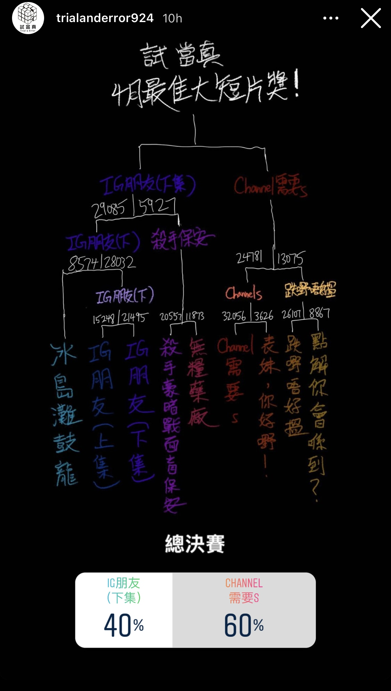
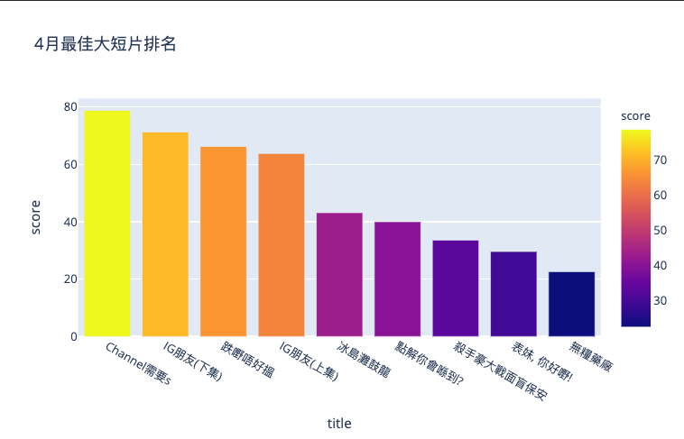

# 試當真最佳大短片排名估算 Trial And Error Best Video Ranking Estimation

## Introduction

> 數據係唔會呃人㗎
> 
> -- _許賢_

Youtube 頻道試當真每月會用ig story舉行"最佳大短片"票選。

Every month, Hong Kong youtube channel hosts a "best short video" vote using ig story. 

可是，在一對一淘汰制下，不少大熱短片會在早輪遇上勁敵出局，令觀眾大感可惜。

However, many popular videos were eliminated early when they were paired with strong opponents. 



為了替這些出色作品討回公道，我嘗試利用票數估算每月的總排名。

In order to bring justice to them, I want to estimate the full ranks each month using the votes. 

Bradley–Terry model是一個利用對比數據估算數值的統計模型，常見於體育比賽（或線上遊戲的排名，i.e.打rank）。

The Bradley–Terry model is a pairwise-comparison model commonly used for estimating skill levels in sports tournaments, or ranking in online games.



排名計算的方法，詳見[Jupyter Notebook](main.ipynb)

Please refer to the [Jupyter Notebook](main.ipynb) for the implementation. 

## Getting Started

Clone the repository to get the code

### Prerequisites

* Python 3 (I am using 3.8)

### Running

1. Install Python dependencies

    ```shell
    pip install -r requirements.txt
    ```

2. Run jupyter notebook
   
    ```shell
    jupyter notebook
    ```
   
3. Open `main.ipynb` and run the cells. 

### Loading new data

To estimate the ranking using other data, prepare your own comparison matrix csv

## Built With

* [choix](http://choix.lum.li/en/latest/) - Python comparison probability model library